# 📘 SiteCraft — Product Requirements Document (PRD)
*(Version 1.0)*

## 1. Product Overview
SiteCraft is a multi-tenant SaaS platform that enables organizations, trainers, companies, and individuals to create fully customized, template-based websites within minutes.  
Each tenant receives a personalized site with modules like Courses, Blog, Booking, Store, Certificates, and more.

---

## 2. Vision & Mission

### Vision
To become the #1 Arabic-first SaaS platform for building multi-template professional websites without technical experience.

### Mission
Deliver a flexible, fast, powerful Template-as-a-Service system that allows users to launch websites in minutes.

---

## 3. Target Users
- Training centers & academies  
- SMEs (Small to Medium Businesses)  
- Coaches & consultants  
- Small e-commerce sellers  
- Freelancers & creators  

---

## 4. Core Features (MVP)
1. Template selection (Educational, Services, Store Lite, Portfolio, Coach)  
2. Branding customization (colors, typography, logo, images)  
3. Multi-tenant system (subdomains + custom domains)  
4. Modules (Courses, Blog, Booking, Store, Certificates)  
5. Dashboard with analytics  
6. Payment integration (Stripe, PayPal)  
7. Super Admin panel  
8. Page Builder (simple block-based system)

---

## 5. Personas
- Super Admin  
- Tenant Admin  
- Tenant Staff / Instructor  
- End User (Student, Customer, Visitor)

---

## 6. System Flow

```mermaid
flowchart LR
    User[👤 Visitor / Student] -->|Visits Website| TenantSite
    TenantSite -->|API Requests| Backend
    TenantAdmin[🧑‍💼 Tenant Admin] -->|Manages Site| Dashboard
    Dashboard --> Backend
    Backend --> Database[(MySQL)]
    Backend --> Integrations[Zoom / Email / Payment]
    SuperAdmin[👑 Super Admin] -->|Manage Tenants| SuperPanel
    SuperPanel --> Backend
```


---

## 7. Detailed Features

### Template Engine
- Template list  
- Preview  
- Apply and switch template  
- Template metadata (colors, layout, sections)

### Site Customization
- Logo upload  
- Color & typography settings  
- Homepage blocks  
- Custom pages  
- Navigation builder  

### Content Modules
- Courses Module  
- Lessons module  
- Blog (posts, tags, SEO)  
- Booking (calendar, confirmations)  
- Store Lite (simple products)  

---

## 7.5. User Stories & Acceptance Criteria

### Epic 1: Tenant Onboarding & Setup 🎯

#### US-001: Sign Up and Create Tenant Account
**As a** new user  
**I want to** sign up and create my SiteCraft account  
**So that** I can start building my website

**Acceptance Criteria:**
- ✅ User can register with email and password
- ✅ Email verification sent automatically
- ✅ Password must meet security requirements (8+ chars, 1 uppercase, 1 number)
- ✅ Subdomain availability checked in real-time
- ✅ User redirected to onboarding wizard after verification

**Priority:** Must-have  
**Story Points:** 5

---

#### US-002: Select Website Template
**As a** tenant admin  
**I want to** browse and select from available templates  
**So that** I can choose the best design for my business

**Acceptance Criteria:**
- ✅ Display all available templates with previews
- ✅ Filter templates by category (Educational, Services, Store, Portfolio, Coach)
- ✅ Live preview of template before selection
- ✅ Template metadata shows included features
- ✅ One-click template selection

**Priority:** Must-have  
**Story Points:** 8

---

#### US-003: Customize Branding
**As a** tenant admin  
**I want to** customize my site's branding (logo, colors, fonts)  
**So that** my website matches my brand identity

**Acceptance Criteria:**
- ✅ Upload custom logo (PNG, JPG, SVG, max 2MB)
- ✅ Select primary and secondary colors with color picker
- ✅ Choose from 10+ font combinations
- ✅ Live preview of changes
- ✅ Save and apply branding across all pages

**Priority:** Must-have  
**Story Points:** 8

---

#### US-004: Configure Site Settings
**As a** tenant admin  
**I want to** configure basic site settings  
**So that** my site has correct information

**Acceptance Criteria:**
- ✅ Set site title and tagline
- ✅ Add site description for SEO
- ✅ Configure contact information
- ✅ Set timezone and language
- ✅ Add social media links

**Priority:** Must-have  
**Story Points:** 5

---

### Epic 2: Content Management 📝

#### US-005: Create Course
**As a** tenant admin/instructor  
**I want to** create a new course  
**So that** I can offer educational content to students

**Acceptance Criteria:**
- ✅ Enter course title, description, and short description
- ✅ Upload course thumbnail image
- ✅ Set course price and currency
- ✅ Set course level (Beginner, Intermediate, Advanced)
- ✅ Set course duration estimate
- ✅ Save as draft or publish immediately

**Priority:** Must-have  
**Story Points:** 8

---

#### US-006: Add Lessons to Course
**As a** instructor  
**I want to** add lessons to my course  
**So that** I can structure my educational content

**Acceptance Criteria:**
- ✅ Create lesson with title and content
- ✅ Add video URL (YouTube, Vimeo, or uploaded)
- ✅ Set lesson duration
- ✅ Reorder lessons via drag-and-drop
- ✅ Mark lessons as free preview
- ✅ Rich text editor for lesson content

**Priority:** Must-have  
**Story Points:** 13

---

#### US-007: Publish Blog Post
**As a** tenant admin  
**I want to** create and publish blog posts  
**So that** I can share content and improve SEO

**Acceptance Criteria:**
- ✅ Create post with title, content, and excerpt
- ✅ Upload featured image
- ✅ Assign to category
- ✅ Add tags for SEO
- ✅ Set publish date (immediate or scheduled)
- ✅ Preview before publishing

**Priority:** Should-have  
**Story Points:** 8

---

### Epic 3: E-commerce & Booking 💰

#### US-008: Add Product to Store
**As a** tenant admin  
**I want to** add products to my store  
**So that** I can sell physical or digital goods

**Acceptance Criteria:**
- ✅ Enter product name, description, and SKU
- ✅ Set price and currency
- ✅ Upload multiple product images
- ✅ Set stock quantity
- ✅ Assign to category
- ✅ Set product status (active/inactive)

**Priority:** Should-have  
**Story Points:** 8

---

#### US-009: Create Booking Slots
**As a** tenant admin  
**I want to** create booking time slots  
**So that** customers can book appointments

**Acceptance Criteria:**
- ✅ Set slot title and description
- ✅ Define start and end time
- ✅ Set capacity (number of bookings allowed)
- ✅ Set price per booking
- ✅ Recurring slots option (daily, weekly)
- ✅ Block specific dates

**Priority:** Should-have  
**Story Points:** 13

---

#### US-010: Process Payment
**As an** end user  
**I want to** pay for courses/products/bookings securely  
**So that** I can access the content/service

**Acceptance Criteria:**
- ✅ Support Stripe and PayPal
- ✅ Secure payment form (PCI compliant)
- ✅ Order confirmation email sent
- ✅ Payment receipt generated
- ✅ Automatic access granted after successful payment
- ✅ Refund capability for admin

**Priority:** Must-have  
**Story Points:** 13

---

### Epic 4: Site Building & Pages 🏗️

#### US-011: Create Custom Page
**As a** tenant admin  
**I want to** create custom pages  
**So that** I can add About, Contact, Terms pages

**Acceptance Criteria:**
- ✅ Create page with title and slug
- ✅ Block-based page builder
- ✅ Add text, images, videos, buttons
- ✅ Drag-and-drop block reordering
- ✅ Publish or save as draft
- ✅ SEO meta fields

**Priority:** Must-have  
**Story Points:** 13

---

#### US-012: Build Navigation Menu
**As a** tenant admin  
**I want to** create and manage navigation menus  
**So that** users can navigate my site easily

**Acceptance Criteria:**
- ✅ Create menu with custom name
- ✅ Add menu items (pages, courses, external links)
- ✅ Nest menu items (dropdown support)
- ✅ Drag-and-drop reordering
- ✅ Assign menu to location (header, footer)

**Priority:** Must-have  
**Story Points:** 8

---

### Epic 5: Analytics & Reporting 📊

#### US-013: View Dashboard Analytics
**As a** tenant admin  
**I want to** view key metrics on my dashboard  
**So that** I can track my site's performance

**Acceptance Criteria:**
- ✅ Display total visitors (last 7/30 days)
- ✅ Show total enrollments/orders
- ✅ Display revenue metrics
- ✅ Show top performing courses/products
- ✅ Chart visualizations
- ✅ Export data as CSV

**Priority:** Should-have  
**Story Points:** 13

---

### Epic 6: Super Admin Management 👑

#### US-014: Manage Tenants
**As a** super admin  
**I want to** view and manage all tenants  
**So that** I can monitor the platform

**Acceptance Criteria:**
- ✅ List all tenants with key info
- ✅ Search and filter tenants
- ✅ View tenant details and usage
- ✅ Suspend or activate tenant
- ✅ Delete tenant (with confirmation)
- ✅ View tenant analytics

**Priority:** Must-have  
**Story Points:** 13

---

### MoSCoW Prioritization Summary

**Must-Have (MVP):**
- US-001: Sign Up and Create Account
- US-002: Select Template
- US-003: Customize Branding
- US-004: Configure Site Settings
- US-005: Create Course
- US-006: Add Lessons
- US-010: Process Payment
- US-011: Create Custom Page
- US-012: Build Navigation Menu
- US-014: Manage Tenants

**Should-Have (Phase 2):**
- US-007: Publish Blog Post
- US-008: Add Product to Store
- US-009: Create Booking Slots
- US-013: View Dashboard Analytics

**Could-Have (Future):**
- Advanced SEO tools
- Email marketing integration
- Multi-language support
- Mobile app

**Won't-Have (Out of Scope):**
- Native mobile apps (Phase 1)
- AI content generation (Phase 1)
- White-label reseller program (Phase 1)

---

## 8. Technical Requirements

### Frontend
- React 19 + Vite  
- TypeScript  
- TailwindCSS  
- Theme manager  
- Tenant-based routing  

### Backend
- ASP.NET Core 8  
- Clean Architecture  
- Multi-tenant middleware  
- MySQL 8  
- Redis  
- JWT Authentication  
- Azure Blob Storage / S3

### DevOps
- Docker  
- Docker Compose  
- Nginx Reverse Proxy  
- Certbot SSL  
- CI/CD  

---

## 8.5. API Design Overview

### Base URL Structure
```
Production: https://api.sitecraft.com/v1
Staging: https://api-staging.sitecraft.com/v1
Development: http://localhost:8000/api/v1
```

### Authentication Endpoints
```http
POST   /api/v1/auth/register          # Register new user
POST   /api/v1/auth/login             # Login and get JWT token
POST   /api/v1/auth/refresh           # Refresh JWT token
POST   /api/v1/auth/logout            # Logout
POST   /api/v1/auth/forgot-password   # Request password reset
POST   /api/v1/auth/reset-password    # Reset password with token
GET    /api/v1/auth/verify-email      # Verify email address
```

### Tenant Management
```http
GET    /api/v1/tenants                # List all tenants (Super Admin)
POST   /api/v1/tenants                # Create new tenant
GET    /api/v1/tenants/{id}           # Get tenant details
PUT    /api/v1/tenants/{id}           # Update tenant
DELETE /api/v1/tenants/{id}           # Delete tenant
POST   /api/v1/tenants/{id}/suspend   # Suspend tenant
POST   /api/v1/tenants/{id}/activate  # Activate tenant
```

### Site & Template Management
```http
GET    /api/v1/templates              # List available templates
GET    /api/v1/templates/{id}         # Get template details
GET    /api/v1/site                   # Get current tenant's site
PUT    /api/v1/site                   # Update site settings
PUT    /api/v1/site/branding          # Update branding
POST   /api/v1/site/apply-template    # Apply template to site
```

### Module Management
```http
GET    /api/v1/modules                # List available modules
GET    /api/v1/modules/active         # List active modules for tenant
POST   /api/v1/modules/{id}/activate  # Activate module
POST   /api/v1/modules/{id}/deactivate # Deactivate module
PUT    /api/v1/modules/{id}/settings  # Update module settings
```

### Course Management
```http
GET    /api/v1/courses                # List courses
POST   /api/v1/courses                # Create course
GET    /api/v1/courses/{id}           # Get course details
PUT    /api/v1/courses/{id}           # Update course
DELETE /api/v1/courses/{id}           # Delete course
POST   /api/v1/courses/{id}/publish   # Publish course
POST   /api/v1/courses/{id}/unpublish # Unpublish course

GET    /api/v1/courses/{id}/lessons   # List lessons
POST   /api/v1/courses/{id}/lessons   # Create lesson
PUT    /api/v1/lessons/{id}           # Update lesson
DELETE /api/v1/lessons/{id}           # Delete lesson
POST   /api/v1/lessons/reorder        # Reorder lessons
```

### Enrollment & Progress
```http
POST   /api/v1/courses/{id}/enroll    # Enroll in course
GET    /api/v1/enrollments            # List user's enrollments
GET    /api/v1/enrollments/{id}       # Get enrollment details
PUT    /api/v1/enrollments/{id}/progress # Update progress
POST   /api/v1/enrollments/{id}/complete # Mark as complete
```

### Blog Management
```http
GET    /api/v1/blog/posts             # List blog posts
POST   /api/v1/blog/posts             # Create post
GET    /api/v1/blog/posts/{id}        # Get post details
PUT    /api/v1/blog/posts/{id}        # Update post
DELETE /api/v1/blog/posts/{id}        # Delete post
GET    /api/v1/blog/categories        # List categories
POST   /api/v1/blog/categories        # Create category
```

### Store Management
```http
GET    /api/v1/store/products         # List products
POST   /api/v1/store/products         # Create product
GET    /api/v1/store/products/{id}    # Get product details
PUT    /api/v1/store/products/{id}    # Update product
DELETE /api/v1/store/products/{id}    # Delete product
GET    /api/v1/store/categories       # List categories
```

### Booking Management
```http
GET    /api/v1/bookings/slots         # List booking slots
POST   /api/v1/bookings/slots         # Create slot
GET    /api/v1/bookings/slots/{id}    # Get slot details
PUT    /api/v1/bookings/slots/{id}    # Update slot
DELETE /api/v1/bookings/slots/{id}    # Delete slot
POST   /api/v1/bookings               # Create booking
GET    /api/v1/bookings               # List bookings
```

### Orders & Payments
```http
POST   /api/v1/orders                 # Create order
GET    /api/v1/orders                 # List orders
GET    /api/v1/orders/{id}            # Get order details
POST   /api/v1/orders/{id}/cancel     # Cancel order

POST   /api/v1/payments/process       # Process payment
POST   /api/v1/payments/webhook       # Payment gateway webhook
GET    /api/v1/payments/{id}          # Get payment details
POST   /api/v1/payments/{id}/refund   # Refund payment
```

### Analytics
```http
GET    /api/v1/analytics/dashboard    # Dashboard metrics
GET    /api/v1/analytics/visitors     # Visitor analytics
GET    /api/v1/analytics/revenue      # Revenue analytics
GET    /api/v1/analytics/courses      # Course performance
GET    /api/v1/analytics/export       # Export data as CSV
```

### Authentication Flow Diagram


### Integration Points

**Payment Gateways:**
- Stripe API v2023-10-16
- PayPal REST API v2
- Webhook handlers for payment confirmations

**Email Service:**
- SendGrid API v3
- Transactional emails (verification, password reset, receipts)
- Marketing emails (newsletters, announcements)

**Video Hosting:**
- YouTube API v3 (embed support)
- Vimeo API v3 (embed support)
- Direct upload to S3 with CloudFront delivery

**Communication:**
- Zoom API v2 (meeting integration for live sessions)
- Twilio API (SMS notifications - optional)
- WhatsApp Business API (notifications - optional)

**File Storage:**
- AWS S3 for file uploads
- CloudFront CDN for delivery
- Image optimization via Sharp/Pillow

**Monitoring & Analytics:**
- Google Analytics 4 (optional tenant integration)
- Sentry for error tracking
- CloudWatch for infrastructure monitoring

### Cross-Reference
> 📚 **For detailed database schema and entity relationships**, see [Phase1_System_Analysis.md - Section 7: ERD](./Phase1_System_Analysis.md#7-erd-entity-relationship-diagram)

> 📚 **For complete system architecture and component diagram**, see [Phase1_System_Analysis.md - Section 11: Component Diagram](./Phase1_System_Analysis.md#11-component-diagram)

---

## 9. Multi-Tenant Architecture

```mermaid
flowchart TD
    Request[🌍 Incoming Request] --> Router[🔀 Tenant Router]
    Router -->|tenantA.sitecraft.com| TenantA
    Router -->|tenantB.sitecraft.com| TenantB
    Router -->|tenantC.sitecraft.com| TenantC

    TenantA --> SharedCode[🧠 Shared Backend Code]
    TenantB --> SharedCode
    TenantC --> SharedCode

    SharedCode --> Database[(MySQL Multi-Tenant Schema)]
```


---

## 10. Pricing Plans (Proposed)
| Plan | Monthly | Includes |
|------|---------|----------|
| Starter | $9 | Template + Blog + Basic Pages |
| Pro | $19 | Courses + Booking + Custom Domain |
| Business | $39 | All modules + Analytics + Certificates |
| Enterprise | $99 | Unlimited + dedicated support |

---

---

## 11. Enhanced User Journeys & Flows

### 11.1 Tenant Admin Onboarding Flow


### 11.2 Course Creation & Publishing Flow


### 11.3 Student Enrollment & Payment Flow


### 11.4 Error Scenarios & Handling

**Scenario 1: Subdomain Already Taken**
- **Trigger:** User tries to register with existing subdomain
- **Handling:** Real-time validation, suggest alternatives (e.g., "mysite-2", "mysite-pro")
- **UX:** Red error message below input, auto-suggest available options

**Scenario 2: Payment Failure**
- **Trigger:** Payment gateway returns error
- **Handling:** Log error, show user-friendly message, offer retry or alternative payment method
- **UX:** Modal with error details, "Try Again" and "Use Different Method" buttons

**Scenario 3: File Upload Too Large**
- **Trigger:** User uploads file > 2MB for logo
- **Handling:** Client-side validation before upload, server-side validation as backup
- **UX:** Toast notification with file size limit, option to compress image

**Scenario 4: Session Expired**
- **Trigger:** JWT token expires during active session
- **Handling:** Automatic token refresh using refresh token, redirect to login if refresh fails
- **UX:** Seamless refresh, show "Session expired, please login" only if refresh fails

**Scenario 5: Module Activation Limit Reached**
- **Trigger:** Tenant tries to activate module beyond plan limit
- **Handling:** Check plan limits before activation, show upgrade prompt
- **UX:** Modal explaining limit, "Upgrade Plan" CTA button

### 11.5 Edge Cases

**Edge Case 1: Concurrent Edits**
- **Scenario:** Two admins editing same course simultaneously
- **Solution:** Optimistic locking with last-write-wins, show warning if conflict detected

**Edge Case 2: Deleted Instructor with Active Courses**
- **Scenario:** Instructor user deleted but has published courses
- **Solution:** Reassign courses to tenant owner, maintain course availability

**Edge Case 3: Subscription Expires Mid-Session**
- **Scenario:** User's subscription expires while they're using the site
- **Solution:** Grace period of 7 days, show banner notification, restrict new content creation

**Edge Case 4: Custom Domain DNS Not Propagated**
- **Scenario:** User adds custom domain but DNS not updated
- **Solution:** Show setup instructions, DNS checker tool, estimated propagation time (24-48h)

**Edge Case 5: Refund After Course Completion**
- **Scenario:** Student requests refund after completing 90% of course
- **Solution:** Policy-based decision (e.g., no refund after 50% completion), admin override option

### 11.6 Wireframe Descriptions

**Dashboard Screen:**
- **Header:** Logo, tenant name, navigation menu, user avatar dropdown
- **Sidebar:** Quick links (Courses, Blog, Store, Bookings, Analytics, Settings)
- **Main Area:** 
  - Welcome message with tenant name
  - Key metrics cards (Visitors, Revenue, Enrollments, Orders)
  - Recent activity feed
  - Quick actions (Create Course, New Post, Add Product)
- **Footer:** Support link, documentation, version number

**Template Selection Screen:**
- **Header:** Progress indicator (Step 2 of 5)
- **Filter Bar:** Category dropdown, search box
- **Template Grid:** 3 columns, each showing:
  - Template preview image
  - Template name and description
  - "Preview" and "Select" buttons
  - Tags (e.g., "Best for Education", "E-commerce Ready")
- **Selected Template:** Highlighted border, checkmark icon

**Branding Customization Screen:**
- **Left Panel:** 
  - Logo upload area (drag & drop)
  - Color pickers (Primary, Secondary, Accent)
  - Font selector dropdowns (Heading, Body)
- **Right Panel:** Live preview of site with changes
- **Bottom Bar:** "Back", "Save Draft", "Continue" buttons

**Course Builder Screen:**
- **Top Bar:** Course title, status badge, "Save" and "Publish" buttons
- **Left Sidebar:** Lesson list with drag handles for reordering
- **Main Area:** 
  - Course details form (title, description, price, level)
  - Thumbnail upload
  - Rich text editor for description
- **Right Sidebar:** 
  - Preview panel
  - SEO settings
  - Publishing options

---

## 12. Analytics & Key Performance Indicators

### 12.1 Business Metrics (KPIs)

**Revenue Metrics:**
- **MRR (Monthly Recurring Revenue):** Total monthly subscription revenue
- **ARR (Annual Recurring Revenue):** MRR × 12
- **ARPU (Average Revenue Per User):** Total revenue / Active tenants
- **LTV (Lifetime Value):** Average revenue per tenant over their lifetime
- **CAC (Customer Acquisition Cost):** Marketing spend / New tenants
- **LTV:CAC Ratio:** Target > 3:1

**Growth Metrics:**
- **Monthly Active Tenants (MAT):** Tenants who logged in last 30 days
- **New Tenant Sign-ups:** Per month
- **Churn Rate:** (Cancelled tenants / Total tenants) × 100
- **Retention Rate:** (1 - Churn Rate) × 100
- **Activation Rate:** (Tenants who published site / Total sign-ups) × 100

### 12.2 Product Metrics

**Engagement Metrics:**
- **DAU/MAU Ratio:** Daily active users / Monthly active users
- **Session Duration:** Average time spent per session
- **Pages Per Session:** Average pages viewed
- **Bounce Rate:** % of single-page sessions

**Feature Adoption:**
- **Module Activation Rate:** % of tenants using each module
- **Course Creation Rate:** Courses created per active tenant
- **Blog Post Frequency:** Posts published per month
- **Template Usage:** Most popular templates

**Content Metrics:**
- **Total Courses:** Across all tenants
- **Total Enrollments:** Student enrollments
- **Course Completion Rate:** % of enrolled students who complete
- **Average Course Price:** Mean price across all courses

### 12.3 Technical Metrics

**Performance:**
- **API Response Time:** P50, P95, P99 latency
- **Page Load Time:** Time to First Byte (TTFB), First Contentful Paint (FCP)
- **Uptime:** % availability (target: 99.9%)
- **Error Rate:** % of requests resulting in errors

**Infrastructure:**
- **Database Query Time:** Average and P95
- **Cache Hit Rate:** % of requests served from cache
- **CDN Bandwidth:** GB transferred per month
- **Storage Usage:** Total S3 storage consumed

### 12.4 Dashboard Requirements

**Tenant Admin Dashboard:**
- **Overview Cards:**
  - Total Visitors (7d, 30d, All time)
  - Total Revenue (This month, Last month, All time)
  - Active Enrollments / Orders
  - Site Health Score (SEO, Performance, Security)

- **Charts:**
  - Visitor trend line chart (last 30 days)
  - Revenue bar chart (last 12 months)
  - Top performing courses/products table
  - Traffic sources pie chart

- **Recent Activity Feed:**
  - New enrollments
  - New orders
  - New blog comments
  - New bookings

**Super Admin Dashboard:**
- **Platform Overview:**
  - Total Tenants (Active, Suspended, Cancelled)
  - Total MRR and growth %
  - New sign-ups this month
  - Churn rate

- **Charts:**
  - Tenant growth trend (last 12 months)
  - Revenue by plan tier
  - Module adoption rates
  - System health metrics

- **Tenant List:**
  - Searchable/filterable table
  - Columns: Name, Plan, Status, MRR, Created Date, Actions

### 12.5 Reporting & Export

**Available Reports:**
- Revenue Report (by period, by plan)
- Tenant Activity Report
- Course Performance Report
- Traffic & Engagement Report
- Payment Transactions Report

**Export Formats:**
- CSV (for Excel/Google Sheets)
- PDF (formatted report with charts)
- JSON (for API integrations)

**Scheduled Reports:**
- Weekly summary email to tenant admins
- Monthly business review for super admin
- Quarterly financial reports

---

## 13. Non-Functional Requirements
- Performance: load time < 1.5s  
- Security: HTTPS, JWT, RBAC, XSS protection  
- Scalability: multi-tenant sharding-ready  
- Availability: 99% uptime for MVP  

---

## 14. Detailed Roadmap & Timeline

### Phase 1: Foundation (Weeks 1-4) 🏗️
**Goal:** Multi-tenant infrastructure and authentication

**Week 1-2: Backend Setup**
- ASP.NET Core 8 project initialization with Clean Architecture
- MySQL 8 database setup with multi-tenant schema
- Redis cache configuration
- JWT authentication implementation
- User registration & login APIs
- Email verification system

**Week 3-4: Multi-tenancy Core**
- Tenant model and middleware
- Subdomain routing logic
- Row-level security (RLS) implementation
- Tenant isolation testing
- Super admin panel foundation

**Deliverables:**
- ✅ Working authentication system
- ✅ Multi-tenant database architecture
- ✅ Basic super admin panel

**Team:** 2 Backend Developers, 1 DevOps Engineer

---

### Phase 2: Core Features (Weeks 5-8) 🎨
**Goal:** Template system and site customization

**Week 5-6: Template Engine**
- Template model and storage
- Template preview system
- Template application logic
- Default templates creation (5 templates)
- Template switching functionality

**Week 7-8: Site Customization**
- Branding customization UI
- Logo upload with S3 integration
- Color picker and font selector
- Live preview implementation
- Site settings management

**Deliverables:**
- ✅ 5 production-ready templates
- ✅ Complete branding customization
- ✅ Live preview system

**Team:** 2 Frontend Developers, 2 Backend Developers, 1 UI/UX Designer

---

### Phase 3: Content Modules (Weeks 9-12) 📚
**Goal:** Course and blog modules

**Week 9-10: Course Module**
- Course CRUD operations
- Lesson management
- Video integration (YouTube, Vimeo, S3)
- Rich text editor integration
- Course publishing workflow

**Week 11-12: Blog Module**
- Blog post CRUD
- Category and tag management
- Featured images
- SEO meta fields
- RSS feed generation

**Deliverables:**
- ✅ Fully functional course module
- ✅ Blog module with SEO
- ✅ File management system

**Team:** 2 Frontend Developers, 2 Backend Developers

---

### Phase 4: Commerce & Payments (Weeks 13-16) 💳
**Goal:** Payment processing and e-commerce

**Week 13-14: Payment Integration**
- Stripe integration
- PayPal integration
- Order management system
- Payment webhook handlers
- Receipt generation

**Week 15: Store Module**
- Product CRUD
- Product categories
- Inventory management
- Product images gallery

**Week 16: Booking Module**
- Booking slot management
- Calendar integration
- Booking confirmation emails
- Capacity management

**Deliverables:**
- ✅ Payment processing (Stripe + PayPal)
- ✅ Store module
- ✅ Booking module

**Team:** 2 Backend Developers, 1 Frontend Developer, 1 QA Engineer

---

### Phase 5: Polish & Launch (Weeks 17-20) 🚀
**Goal:** Production readiness and launch

**Week 17: Custom Domains**
- Custom domain configuration
- SSL certificate automation (Let's Encrypt)
- DNS verification
- Domain management UI

**Week 18: Analytics & Reporting**
- Dashboard implementation
- Analytics data collection
- Chart visualizations
- Export functionality

**Week 19: Testing & Optimization**
- Load testing
- Security audit
- Performance optimization
- Bug fixes
- Documentation

**Week 20: Launch Preparation**
- Production deployment
- Monitoring setup
- Beta user onboarding
- Marketing materials
- Launch! 🎉

**Deliverables:**
- ✅ Production-ready platform
- ✅ Complete documentation
- ✅ 10 beta tenants onboarded

**Team:** Full team (6-8 people)

---

### Gantt Chart


### Dependencies
- **Phase 2** depends on Phase 1 (multi-tenancy must work first)
- **Phase 3** depends on Phase 2 (templates needed for content display)
- **Phase 4** depends on Phase 3 (courses/products must exist before payments)
- **Phase 5** can start partially in parallel with Phase 4

### Resource Allocation
- **Total Team Size:** 6-8 people
- **Backend Developers:** 2-3
- **Frontend Developers:** 2-3
- **UI/UX Designer:** 1
- **DevOps Engineer:** 1
- **QA Engineer:** 1 (from Phase 3 onwards)

---

---

## 16. Risk Management & Mitigation

### 16.1 Technical Risks

| Risk | Impact | Probability | Mitigation Strategy | Contingency Plan |
|------|--------|-------------|---------------------|------------------|
| **Multi-tenancy Data Leakage** | Critical | Low | - Row-level security (RLS)<br>- Extensive testing<br>- Security audits<br>- Automated tests for tenant isolation | - Immediate incident response<br>- Data breach insurance<br>- Transparent communication |
| **Performance Degradation at Scale** | High | Medium | - Caching strategy (Redis)<br>- Database indexing<br>- Load testing<br>- CDN for static assets | - Horizontal scaling<br>- Database read replicas<br>- Query optimization |
| **Third-party API Failures** | Medium | Medium | - Fallback mechanisms<br>- Retry logic with exponential backoff<br>- Circuit breakers<br>- Health checks | - Graceful degradation<br>- Queue failed requests<br>- Alternative providers |
| **Database Corruption** | Critical | Very Low | - Daily automated backups<br>- Point-in-time recovery<br>- Replication<br>- Regular backup testing | - Restore from backup<br>- Failover to replica<br>- Data recovery service |
| **Security Vulnerabilities** | Critical | Low | - Regular security audits<br>- Dependency scanning<br>- Penetration testing<br>- Security headers | - Immediate patching<br>- Incident response team<br>- Bug bounty program |

### 16.2 Business Risks

| Risk | Impact | Probability | Mitigation Strategy | Contingency Plan |
|------|--------|-------------|---------------------|------------------|
| **Low Customer Acquisition** | High | Medium | - Content marketing<br>- SEO optimization<br>- Free trial period<br>- Referral program | - Adjust pricing<br>- Pivot target market<br>- Partnership deals |
| **High Churn Rate** | High | Medium | - Excellent onboarding<br>- Customer support<br>- Regular feature updates<br>- Customer feedback loops | - Win-back campaigns<br>- Exit interviews<br>- Feature improvements |
| **Pricing Too Low/High** | Medium | Medium | - Market research<br>- Competitor analysis<br>- A/B testing<br>- Flexible tiers | - Price adjustments<br>- Value-based pricing<br>- Custom enterprise plans |
| **Competitor Launches Similar Product** | Medium | High | - Unique value proposition<br>- Superior UX<br>- Arabic-first focus<br>- Faster innovation | - Feature differentiation<br>- Niche specialization<br>- Customer lock-in |
| **Regulatory Changes (GDPR, etc.)** | Medium | Low | - Legal consultation<br>- Compliance monitoring<br>- Privacy by design<br>- Regular audits | - Rapid compliance updates<br>- Legal team<br>- Insurance |

### 16.3 Operational Risks

| Risk | Impact | Probability | Mitigation Strategy | Contingency Plan |
|------|--------|-------------|---------------------|------------------|
| **Key Team Member Leaves** | Medium | Medium | - Documentation<br>- Knowledge sharing<br>- Cross-training<br>- Code reviews | - Hiring pipeline<br>- Contractor backup<br>- Pair programming |
| **Infrastructure Outage** | High | Low | - Multi-AZ deployment<br>- Automated failover<br>- Monitoring & alerts<br>- SLA with AWS | - Manual failover<br>- Status page<br>- Customer communication |
| **Payment Gateway Issues** | Medium | Low | - Multiple payment providers<br>- Webhook redundancy<br>- Manual reconciliation | - Alternative payment method<br>- Manual processing<br>- Refund policy |
| **Support Overwhelm** | Medium | Medium | - Self-service documentation<br>- Chatbot<br>- Knowledge base<br>- Ticket system | - Temporary support staff<br>- Community forum<br>- Priority tiers |

### 16.4 Mitigation Timeline

**Pre-Launch (Weeks 1-20):**
- ✅ Implement all security best practices
- ✅ Set up monitoring and alerting
- ✅ Create comprehensive documentation
- ✅ Establish backup and recovery procedures
- ✅ Conduct security audit

**Post-Launch (Months 1-3):**
- ✅ Monitor all metrics closely
- ✅ Gather customer feedback
- ✅ Iterate on features
- ✅ Optimize performance
- ✅ Build customer support processes

**Ongoing:**
- ✅ Regular security audits (quarterly)
- ✅ Performance testing (monthly)
- ✅ Backup testing (monthly)
- ✅ Customer satisfaction surveys (quarterly)
- ✅ Competitor analysis (monthly)

---

## 17. Success Metrics & Launch Criteria

### 17.1 MVP Launch Criteria

**Technical Readiness:**
- ✅ All Phase 1-3 features complete and tested
- ✅ Security audit passed with no critical vulnerabilities
- ✅ Load testing: 1000 concurrent users without degradation
- ✅ Page load time < 2 seconds (95th percentile)
- ✅ API response time < 500ms (average)
- ✅ 99% uptime during beta period

**Business Readiness:**
- ✅ 10 beta tenants successfully onboarded
- ✅ At least 5 tenants published live sites
- ✅ Pricing plans finalized and tested
- ✅ Payment processing working (Stripe + PayPal)
- ✅ Customer support system in place
- ✅ Documentation complete (user guides, API docs)

**Legal & Compliance:**
- ✅ Terms of Service finalized
- ✅ Privacy Policy compliant with GDPR
- ✅ Data Processing Agreement ready
- ✅ Refund policy defined
- ✅ SLA commitments documented

### 17.2 6-Month Goals (Post-Launch)

**Growth Targets:**
- 🎯 **100 paying tenants**
- 🎯 **$5,000 MRR** (Monthly Recurring Revenue)
- 🎯 **< 5% monthly churn rate**
- 🎯 **> 70% activation rate** (tenants who publish site)
- 🎯 **> 50% retention rate** (6-month cohort)

**Product Metrics:**
- 🎯 **500+ courses created** across all tenants
- 🎯 **5,000+ student enrollments**
- 🎯 **1,000+ blog posts published**
- 🎯 **> 80% feature adoption** (at least 1 module activated per tenant)

**Technical Metrics:**
- 🎯 **99.9% uptime**
- 🎯 **< 1% error rate**
- 🎯 **< 1.5s average page load time**
- 🎯 **> 90% cache hit rate**

**Customer Satisfaction:**
- 🎯 **NPS (Net Promoter Score) > 50**
- 🎯 **4.5+ average rating** (out of 5)
- 🎯 **< 24h average support response time**
- 🎯 **> 90% customer satisfaction score**

### 17.3 12-Month Vision

**Platform Growth:**
- 🚀 **500 paying tenants**
- 🚀 **$25,000 MRR**
- 🚀 **Expand to 3 new markets** (Saudi Arabia, UAE, Egypt)
- 🚀 **Launch mobile app** (iOS & Android)
- 🚀 **White-label reseller program**

**Product Evolution:**
- 🚀 **AI-powered content suggestions**
- 🚀 **Advanced analytics & reporting**
- 🚀 **Multi-language support** (Arabic, English, French)
- 🚀 **Marketplace for templates & plugins**
- 🚀 **Email marketing integration**

---

## 18. Cross-References & Related Documents

**Related Documents:**
- 📚 [Phase1_System_Analysis.md](./Phase1_System_Analysis.md) - Complete system architecture, ERD, and technical specifications
- 📚 Technical API Documentation - Detailed API reference (to be created)
- 📚 UI/UX Design System - Wireframes, mockups, and design guidelines (to be created)
- 📚 Security & Compliance Guide - Security best practices and compliance checklist (to be created)

**Key Sections in Phase1_System_Analysis.md:**
- Section 7: ERD with 20+ entities
- Section 8: Class Diagram with service layer
- Section 9: State Diagrams (Tenant & Subscription lifecycle)
- Section 11: Component Diagram (system architecture)
- Section 12: Deployment Diagram (infrastructure)
- Section 13: Multi-tenancy Strategy
- Section 14: Non-Functional Requirements

---

## 15. Final Notes
SiteCraft is a scalable, reusable, high-profit SaaS that can be resold to hundreds of clients with minimal incremental effort.
