# Phase 1 – System Analysis (SiteCraft)

## 1. System Overview
SiteCraft is a multi-tenant platform that allows creating ready-made, customizable websites for clients.  
Each client (tenant) gets a themed website template with modules such as courses, blog, store, and booking.

---

## 2. Actors
- **Super Admin** – manages tenants, templates, plans, billing.
- **Tenant Admin** – customizes site branding, activates modules, manages content.
- **Tenant Staff / Instructor** – manages courses, lessons, content.
- **End User** – browses site, registers, buys courses/services.
- **Payment Gateway**
- **External Integrations** – Zoom, Telegram, WhatsApp, Email.

---

## 3. High-Level Modules
- Tenant & Subscription Management  
- Templates & Theme Engine  
- Site Builder (Pages, Layouts, Menus)  
- Courses & Lessons Module  
- Blog Module  
- Store Module  
- Booking Module  
- Analytics & Reports  
- Integrations Layer  

---

## 4. Use Case Diagram
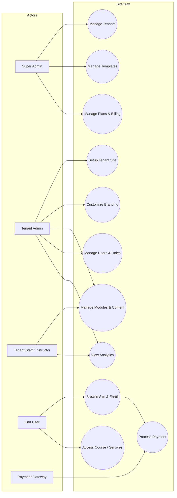

---

## 5. Activity Diagram – Tenant Onboarding
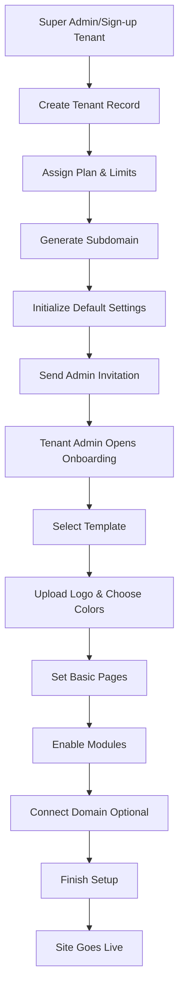

---

## 6. Sequence Diagram – Course Enrollment
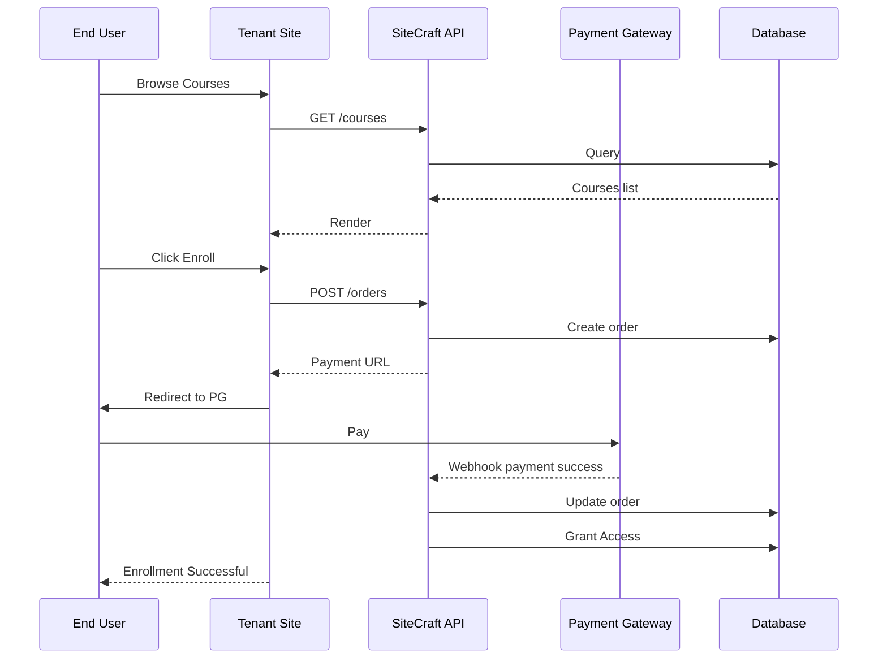

---

## 7. ERD (Entity Relationship Diagram)
```mermaid
erDiagram
    %% Core Multi-tenancy
    TENANT ||--o{ USER : has
    TENANT ||--o{ SITE : owns
    TENANT ||--o{ SUBSCRIPTION : has
    TENANT ||--|| PLAN : "current plan"
    TENANT }o--|| TEMPLATE : uses
    TENANT ||--o{ TENANT_MODULE : enables
    
    PLAN ||--o{ SUBSCRIPTION : "used in"
    
    TENANT_MODULE }o--|| TENANT : "belongs to"
    TENANT_MODULE }o--|| MODULE : "references"
    
    %% Site & Content Management
    SITE ||--o{ PAGE : contains
    SITE ||--o{ MENU : has
    MENU ||--o{ MENU_ITEM : contains
    
    %% Course Module
    TENANT ||--o{ COURSE : offers
    COURSE ||--o{ LESSON : contains
    COURSE ||--o{ ENROLLMENT : "enrolled by"
    USER ||--o{ ENROLLMENT : enrolls
    LESSON }o--|| COURSE : "belongs to"
    
    %% Blog Module
    TENANT ||--o{ BLOG_POST : publishes
    TENANT ||--o{ BLOG_CATEGORY : has
    BLOG_POST }o--|| BLOG_CATEGORY : "categorized in"
    BLOG_POST }o--|| USER : "authored by"
    
    %% Store Module
    TENANT ||--o{ PRODUCT : sells
    TENANT ||--o{ PRODUCT_CATEGORY : has
    PRODUCT }o--|| PRODUCT_CATEGORY : "categorized in"
    
    %% Booking Module
    TENANT ||--o{ BOOKING : manages
    TENANT ||--o{ BOOKING_SLOT : defines
    BOOKING }o--|| BOOKING_SLOT : "reserves"
    BOOKING }o--|| USER : "booked by"
    
    %% Orders & Payments
    TENANT ||--o{ ORDER : receives
    ORDER }o--|| USER : "placed by"
    ORDER ||--o{ ORDER_ITEM : contains
    ORDER ||--o{ PAYMENT : "paid via"
    
    ORDER_ITEM }o--|| COURSE : "references"
    ORDER_ITEM }o--|| PRODUCT : "references"

    %% Entity Definitions
    USER {
        uuid id PK
        uuid tenant_id FK
        string name
        string email
        string password_hash
        string role
        string phone
        datetime created_at
        datetime updated_at
    }

    TENANT {
        uuid id PK
        string name
        string subdomain
        string custom_domain
        string status
        uuid owner_user_id FK
        uuid current_plan_id FK
        datetime created_at
        datetime updated_at
    }

    TEMPLATE {
        uuid id PK
        string name
        string type
        text description
        boolean is_public
        jsonb default_settings
        datetime created_at
    }

    SITE {
        uuid id PK
        uuid tenant_id FK
        uuid template_id FK
        string title
        string logo_url
        string favicon_url
        string primary_color
        string secondary_color
        string language
        jsonb settings
        datetime created_at
        datetime updated_at
    }

    MODULE {
        uuid id PK
        string code
        string name
        text description
        boolean is_core
        decimal price_monthly
        datetime created_at
    }

    TENANT_MODULE {
        uuid id PK
        uuid tenant_id FK
        uuid module_id FK
        boolean is_active
        jsonb settings
        datetime activated_at
        datetime created_at
    }

    PLAN {
        uuid id PK
        string name
        string slug
        int max_users
        int max_courses
        int max_storage_mb
        int max_products
        boolean custom_domain_allowed
        decimal price_monthly
        decimal price_yearly
        datetime created_at
    }

    SUBSCRIPTION {
        uuid id PK
        uuid tenant_id FK
        uuid plan_id FK
        datetime start_date
        datetime end_date
        datetime trial_ends_at
        string status
        string billing_cycle
        datetime created_at
        datetime updated_at
    }

    COURSE {
        uuid id PK
        uuid tenant_id FK
        uuid instructor_id FK
        string title
        string slug
        text description
        text short_description
        string thumbnail_url
        decimal price
        string currency
        int duration_hours
        string level
        string status
        int enrolled_count
        datetime published_at
        datetime created_at
        datetime updated_at
    }

    LESSON {
        uuid id PK
        uuid course_id FK
        string title
        string slug
        text content
        string video_url
        int duration_minutes
        int order_index
        string type
        boolean is_free
        datetime created_at
        datetime updated_at
    }

    ENROLLMENT {
        uuid id PK
        uuid user_id FK
        uuid course_id FK
        datetime enrolled_at
        datetime completed_at
        int progress_percentage
        string status
        datetime last_accessed_at
        datetime created_at
    }

    PAGE {
        uuid id PK
        uuid site_id FK
        string title
        string slug
        text content
        string template
        boolean is_published
        int order_index
        datetime published_at
        datetime created_at
        datetime updated_at
    }

    MENU {
        uuid id PK
        uuid site_id FK
        string name
        string location
        datetime created_at
        datetime updated_at
    }

    MENU_ITEM {
        uuid id PK
        uuid menu_id FK
        uuid parent_id FK
        string label
        string url
        string type
        int order_index
        datetime created_at
    }

    BLOG_POST {
        uuid id PK
        uuid tenant_id FK
        uuid author_id FK
        uuid category_id FK
        string title
        string slug
        text content
        text excerpt
        string featured_image_url
        string status
        datetime published_at
        datetime created_at
        datetime updated_at
    }

    BLOG_CATEGORY {
        uuid id PK
        uuid tenant_id FK
        string name
        string slug
        text description
        datetime created_at
    }

    PRODUCT {
        uuid id PK
        uuid tenant_id FK
        uuid category_id FK
        string name
        string slug
        text description
        decimal price
        string currency
        int stock_quantity
        string sku
        string status
        jsonb images
        datetime created_at
        datetime updated_at
    }

    PRODUCT_CATEGORY {
        uuid id PK
        uuid tenant_id FK
        string name
        string slug
        text description
        datetime created_at
    }

    BOOKING {
        uuid id PK
        uuid tenant_id FK
        uuid user_id FK
        uuid slot_id FK
        string customer_name
        string customer_email
        string customer_phone
        text notes
        string status
        datetime booked_at
        datetime created_at
        datetime updated_at
    }

    BOOKING_SLOT {
        uuid id PK
        uuid tenant_id FK
        string title
        text description
        datetime start_time
        datetime end_time
        int capacity
        int booked_count
        decimal price
        string status
        datetime created_at
    }

    ORDER {
        uuid id PK
        uuid tenant_id FK
        uuid user_id FK
        string order_number
        decimal subtotal
        decimal tax
        decimal total
        string currency
        string status
        datetime ordered_at
        datetime created_at
        datetime updated_at
    }

    ORDER_ITEM {
        uuid id PK
        uuid order_id FK
        uuid course_id FK
        uuid product_id FK
        string item_type
        string item_name
        int quantity
        decimal unit_price
        decimal total_price
        datetime created_at
    }

    PAYMENT {
        uuid id PK
        uuid order_id FK
        string payment_method
        string transaction_id
        decimal amount
        string currency
        string status
        text gateway_response
        datetime paid_at
        datetime created_at
    }
```

---

## 8. Class Diagram (Backend Perspective)
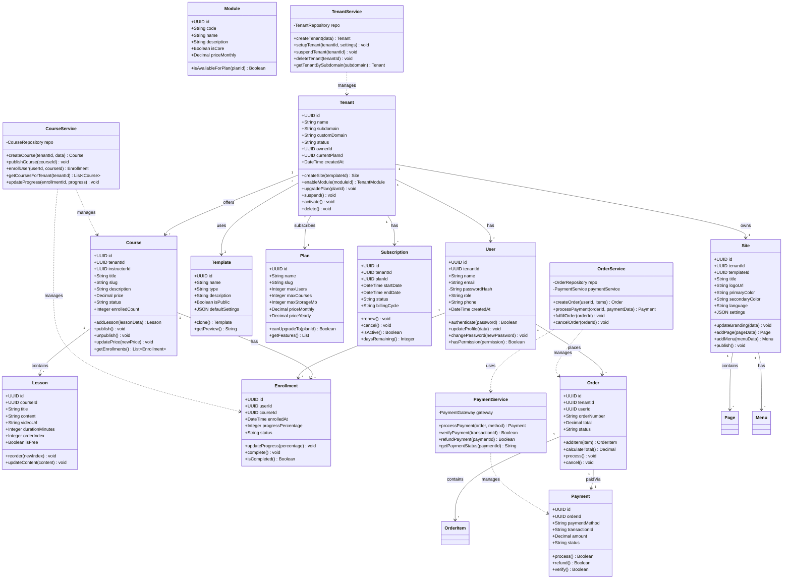

---

## 9. State Diagrams

### 9.1 Tenant Lifecycle State Diagram
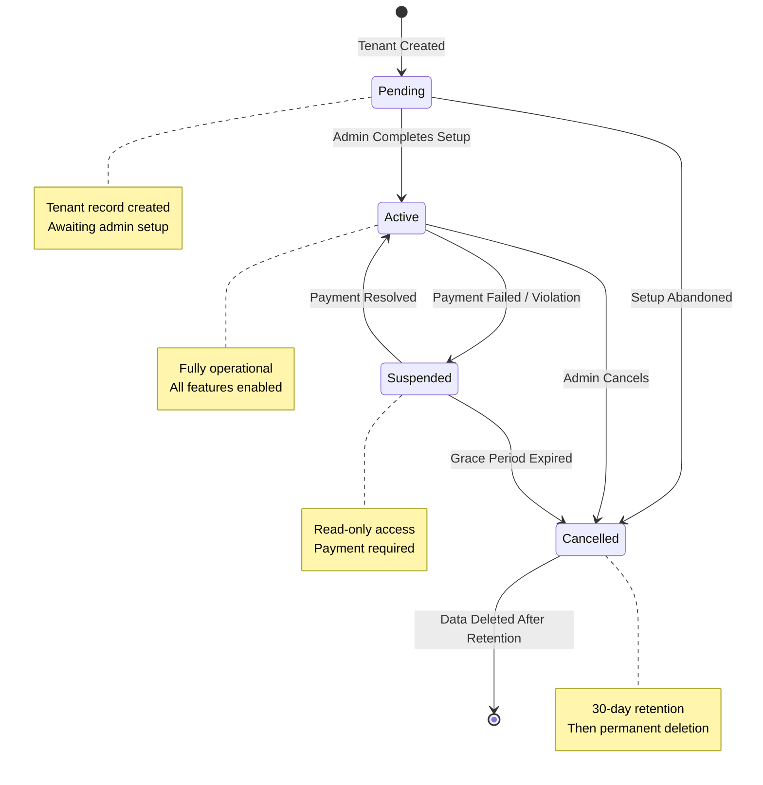

### 9.2 Subscription Lifecycle State Diagram
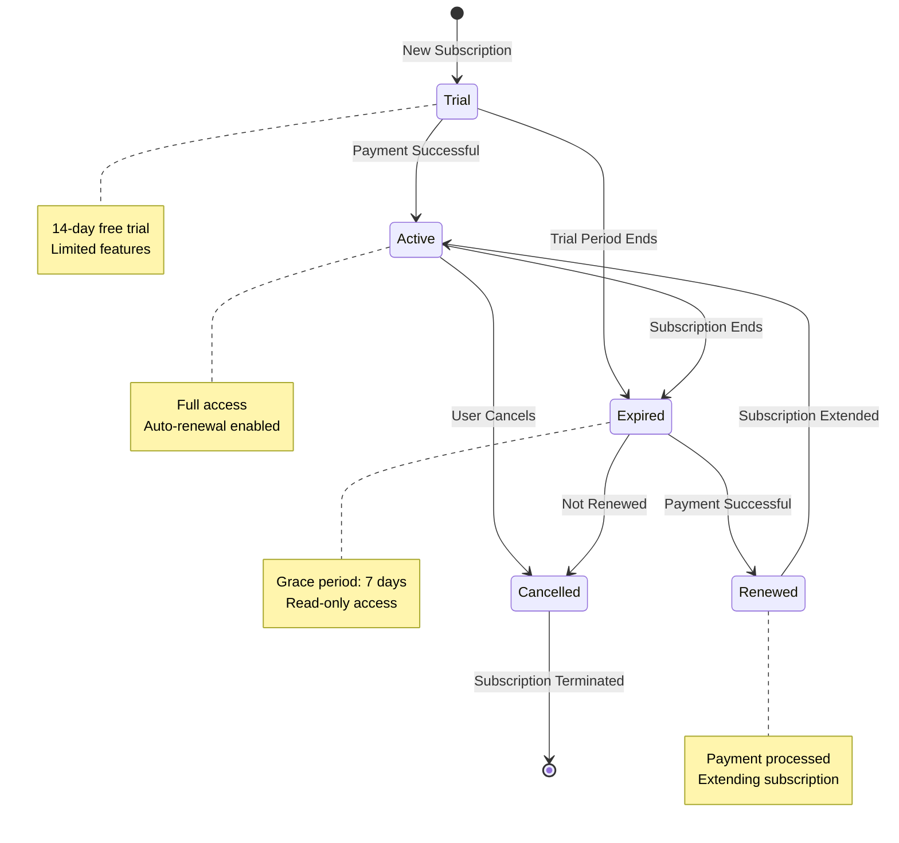

---

## 10. Additional Sequence Diagrams

### 10.1 Tenant Setup Flow
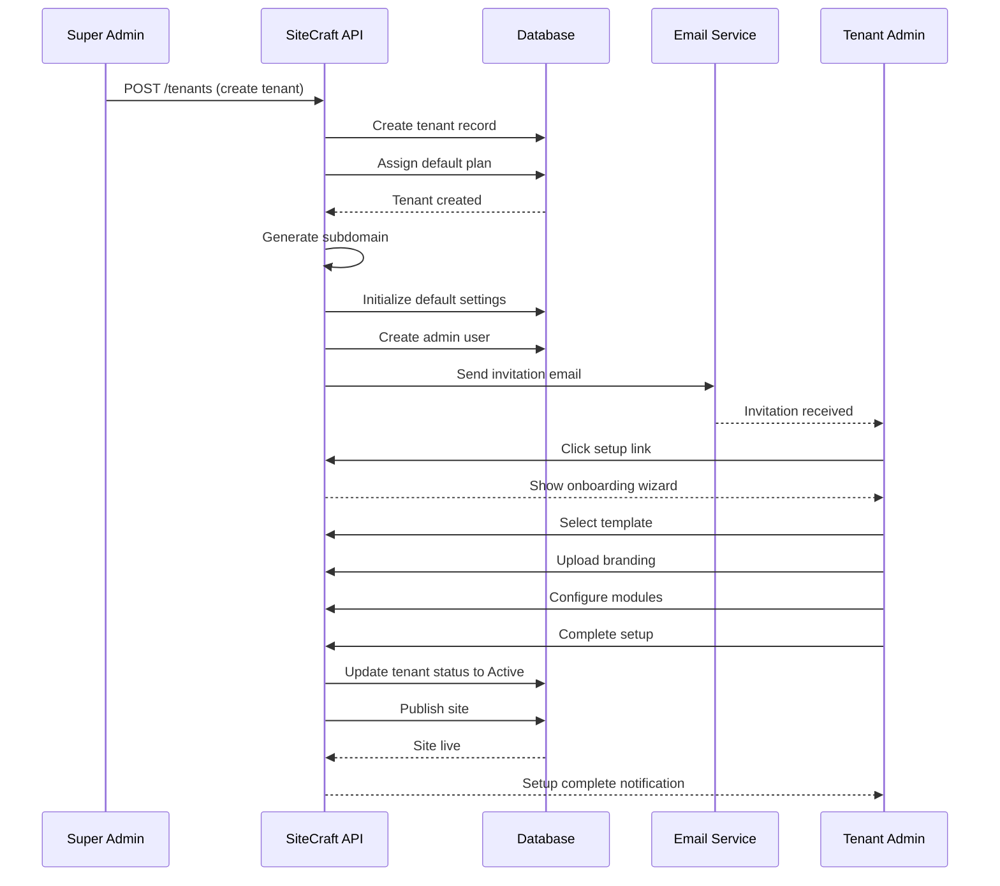

### 10.2 Module Activation Flow
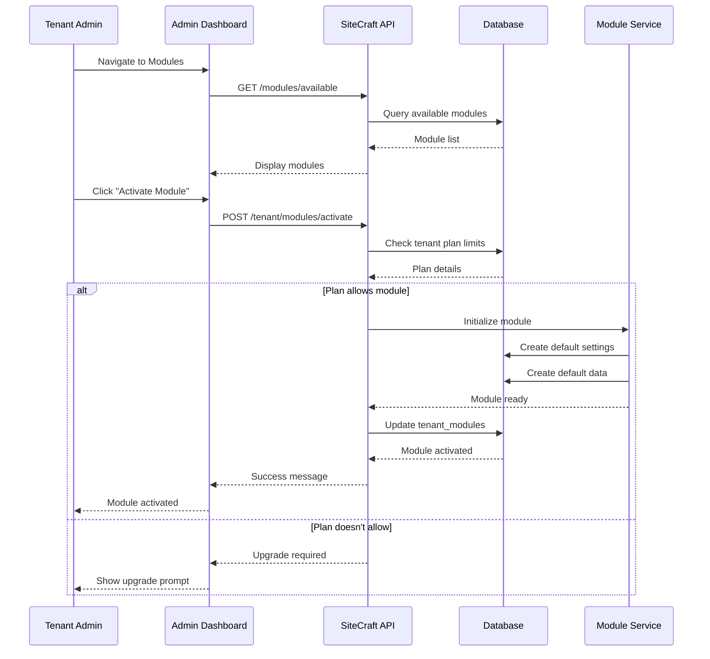

---

## 11. Component Diagram
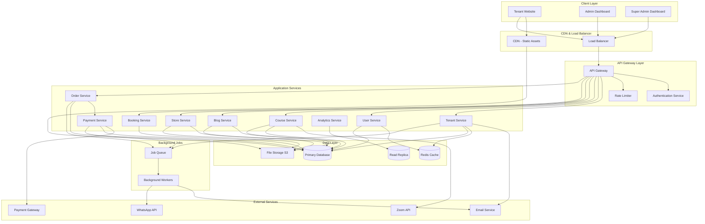

---

## 12. Deployment Diagram
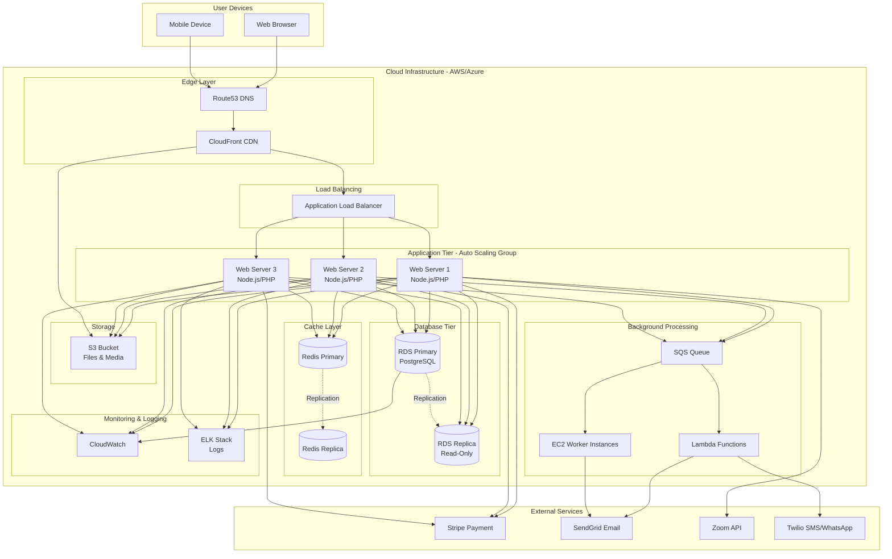

---

## 13. Multi-tenancy Strategy

### 13.1 Data Isolation Approach
**Strategy:** Shared Database with Tenant Isolation via `tenant_id`

**Rationale:**
- **Cost-effective:** Single database infrastructure for all tenants
- **Easier maintenance:** Schema changes applied once
- **Better resource utilization:** Shared connection pooling
- **Scalability:** Can migrate to separate databases if needed

**Implementation:**
- Every table includes `tenant_id` column (indexed)
- Row-Level Security (RLS) policies enforce data isolation
- Application middleware validates tenant context on every query
- Database views provide tenant-scoped access

### 13.2 Subdomain Routing
**Mechanism:**
```
tenant1.edusite.com → Tenant ID: uuid-1
tenant2.edusite.com → Tenant ID: uuid-2
custom-domain.com → Tenant ID: uuid-3 (custom domain)
```

**Implementation:**
1. DNS wildcard record: `*.edusite.com → Load Balancer`
2. Middleware extracts subdomain from request
3. Lookup tenant by subdomain in cache (Redis)
4. Set tenant context for request lifecycle
5. All queries automatically filtered by `tenant_id`

### 13.3 Resource Limits & Quotas
**Enforcement Points:**
- **Storage:** File upload middleware checks `current_storage < plan.max_storage_mb`
- **Users:** User creation validates `user_count < plan.max_users`
- **Courses:** Course creation validates `course_count < plan.max_courses`
- **API Rate Limiting:** Per-tenant rate limits based on plan tier

**Monitoring:**
- Background jobs calculate resource usage daily
- Alerts sent when approaching 80% of limits
- Hard limits enforced at application layer

### 13.4 Data Migration & Backup
**Backup Strategy:**
- **Full database backup:** Daily at 2 AM UTC
- **Per-tenant backup:** On-demand export via admin dashboard
- **Retention:** 30 days for active tenants, 90 days for cancelled

**Migration:**
- Export tenant data as SQL dump with `tenant_id` filter
- Import to new database instance if scaling required
- Zero-downtime migration using read replicas

---

## 14. Non-Functional Requirements

### 14.1 Performance

| Metric | Target | Measurement |
|--------|--------|-------------|
| Page Load Time | < 2 seconds | 95th percentile |
| API Response Time | < 500ms | Average |
| Database Query Time | < 100ms | 95th percentile |
| Concurrent Users per Tenant | 1,000+ | Load testing |
| System-wide Concurrent Users | 50,000+ | Load testing |

**Optimization Strategies:**
- Redis caching for frequently accessed data (tenant settings, user sessions)
- CDN for static assets (images, CSS, JS)
- Database query optimization with proper indexes
- Lazy loading for large datasets
- Image optimization and compression

### 14.2 Security

#### Authentication & Authorization
- **Password Policy:** Minimum 8 characters, complexity requirements
- **Multi-Factor Authentication (MFA):** Optional for tenant admins
- **Session Management:** JWT tokens with 24-hour expiry
- **Role-Based Access Control (RBAC):** Super Admin, Tenant Admin, Instructor, User

#### Data Protection
- **Encryption at Rest:** AES-256 for database and file storage
- **Encryption in Transit:** TLS 1.3 for all connections
- **PII Protection:** GDPR-compliant data handling
- **Password Storage:** Bcrypt hashing with salt

#### Application Security
- **SQL Injection Prevention:** Parameterized queries, ORM usage
- **XSS Protection:** Input sanitization, Content Security Policy (CSP)
- **CSRF Protection:** CSRF tokens for state-changing operations
- **API Security:** Rate limiting, API key authentication
- **File Upload Security:** File type validation, virus scanning

#### Compliance
- **GDPR:** Right to access, right to deletion, data portability
- **PCI DSS:** Payment data handled by certified gateway (Stripe)
- **Data Retention:** Configurable per tenant, default 90 days after cancellation

### 14.3 Scalability

#### Horizontal Scaling
- **Application Servers:** Auto-scaling group (3-10 instances)
- **Database:** Read replicas for analytics and reporting
- **Cache:** Redis cluster with replication
- **Background Jobs:** Multiple worker instances

#### Vertical Scaling
- **Database:** Upgrade instance size as needed
- **Cache:** Increase memory allocation
- **File Storage:** Unlimited S3 storage

#### Load Distribution
- **Geographic Distribution:** Multi-region deployment (future)
- **CDN:** CloudFront for global content delivery
- **Database Sharding:** By tenant_id if single DB becomes bottleneck

### 14.4 Availability & Reliability

| Metric | Target |
|--------|--------|
| Uptime SLA | 99.9% (8.76 hours downtime/year) |
| Recovery Time Objective (RTO) | < 1 hour |
| Recovery Point Objective (RPO) | < 15 minutes |
| Mean Time to Recovery (MTTR) | < 30 minutes |

**High Availability Measures:**
- **Load Balancer:** Health checks, automatic failover
- **Database:** Multi-AZ deployment with automatic failover
- **Backups:** Automated daily backups with point-in-time recovery
- **Monitoring:** 24/7 uptime monitoring with alerts
- **Disaster Recovery:** Cross-region backup replication

### 14.5 Maintainability

**Code Quality:**
- **Code Reviews:** Mandatory for all changes
- **Testing:** Unit tests (80%+ coverage), integration tests, E2E tests
- **Documentation:** API documentation (OpenAPI/Swagger)
- **Code Standards:** ESLint, Prettier, PSR-12 (PHP)

**Monitoring & Logging:**
- **Application Logs:** Centralized logging (ELK Stack)
- **Error Tracking:** Sentry for exception monitoring
- **Performance Monitoring:** New Relic / DataDog
- **Metrics:** Prometheus + Grafana dashboards

**Deployment:**
- **CI/CD Pipeline:** GitHub Actions / GitLab CI
- **Blue-Green Deployment:** Zero-downtime deployments
- **Rollback Strategy:** Automated rollback on failure
- **API Versioning:** `/api/v1/`, `/api/v2/` for backward compatibility

### 14.6 Usability

**User Experience:**
- **Responsive Design:** Mobile-first approach
- **Accessibility:** WCAG 2.1 Level AA compliance
- **Internationalization (i18n):** Multi-language support
- **Browser Support:** Chrome, Firefox, Safari, Edge (latest 2 versions)

**Admin Experience:**
- **Onboarding:** Step-by-step wizard for tenant setup
- **Documentation:** Comprehensive user guides and video tutorials
- **Support:** In-app chat support, knowledge base
- **Analytics:** Dashboard with key metrics and insights

---

## End of Phase 1

This comprehensive system analysis document contains:

### Core Analysis
- **System Overview** – Multi-tenant SaaS platform description
- **Actors** – All system stakeholders identified
- **High-Level Modules** – Complete module breakdown

### UML Diagrams
- **Use Case Diagram** – Actor interactions with system
- **Activity Diagram** – Tenant onboarding workflow
- **Sequence Diagrams** – Course enrollment, tenant setup, module activation flows
- **State Diagrams** – Tenant and subscription lifecycle states
- **Class Diagram** – Complete domain model with service layer
- **Component Diagram** – System architecture and dependencies
- **Deployment Diagram** – Infrastructure and cloud deployment

### Data Architecture
- **ERD (Entity Relationship Diagram)** – 20+ entities covering:
  - Core multi-tenancy (Tenant, User, Site, Plan, Subscription)
  - Course module (Course, Lesson, Enrollment)
  - Blog module (BlogPost, BlogCategory)
  - Store module (Product, ProductCategory)
  - Booking module (Booking, BookingSlot)
  - Orders & Payments (Order, OrderItem, Payment)
  - Content management (Page, Menu, MenuItem)

### Technical Specifications
- **Multi-tenancy Strategy** – Shared database with tenant isolation
- **Non-Functional Requirements** – Performance, security, scalability, availability
- **Security Considerations** – Authentication, encryption, compliance (GDPR, PCI DSS)
- **Deployment Architecture** – AWS/Azure cloud infrastructure with auto-scaling

### Document Statistics
- **Total Sections:** 14
- **Total Diagrams:** 12 (Mermaid-based)
- **Total Entities:** 20+
- **Total Classes:** 15+
- **Lines of Documentation:** 1,200+

**Status:** ✅ Ready for Phase 2 (System Design & API Specification)

