# Docker for Vibe Coders: Build Once, Run Everywhere

## Introduction

In traditional software development, running code depended heavily on the operating system, environment setup, installed packages, and the machine itself. This created the classic problem:

> **"It works on my machine!"**

Docker solved this by introducing a powerful concept:

> **Build once, run everywhere** — package your application once, run it consistently on any machine.

---

## The Idea of a Virtual Machine (VM)

Before Docker, developers used **Virtual Machines**:

* A full computer inside your computer.
* Includes its own operating system.
* Heavy on CPU, RAM, and disk.
* Slow to boot and slow to duplicate.


### ❌ Problems With Virtual Machines

* Very resource‑intensive.
* Slow startup.
* Hard to share or distribute.
* Inefficient for modern development workflows.

---

## Understanding the Operating System Kernel (Simplified for Vibe Coders)

Before we dive into how Docker works, let's understand a key concept: **the kernel**.

### What is a Kernel? Think of it Like a Restaurant

Imagine your computer is a restaurant:


### The Kernel is the "Core Manager"

**The kernel is the bridge between your software and your hardware.**

- **Apps** (like Chrome, VS Code) want to use resources
- **Kernel** controls access to CPU, memory, storage, network
- **Hardware** provides the actual computing power

Think of it this way:
- **Without kernel**: Apps would fight over resources and crash everything
- **With kernel**: Apps politely ask the kernel, which manages everything fairly

### Simple Analogy

| Component | Real World | Computer World |
|-----------|-----------|---------------|
| **Customer** | You ordering food | Your app needing resources |
| **Waiter** | Takes your order | Operating System |
| **Chef/Kitchen** | Prepares the food | **Kernel** (the boss!) |
| **Ingredients** | Raw food items | Hardware (CPU, RAM, etc.) |

**The kernel is the chef** — it knows how to take orders and use the ingredients (hardware) to create what you need!

### Why This Matters for Docker

In a **Virtual Machine**, you have:
- ❌ **Multiple kitchens** (multiple kernels) — very wasteful!
- Each VM has its own complete operating system with its own kernel
- Like having 5 separate restaurants for 5 customers

In **Docker**, you have:
- ✅ **One shared kitchen** (one kernel) — super efficient!
- All containers use the same kernel
- Like having 5 customers sharing one efficient kitchen


**This is why Docker is so fast and lightweight** — it doesn't need to set up entire kitchens (kernels) for each app!

---

## How Docker Improved This Idea

Docker replaced the VM concept with **containers**:

* No full OS inside each container.
* Lightweight and extremely fast.
* Starts in seconds.
* Uses fewer resources.

> **A container = isolated process + required libraries + your code**

Docker containers share the host's system kernel (the shared kitchen!), making them much more efficient than VMs.


### VM vs Docker Comparison


---

## Why Do We Need Multiple Containers and Not Just One?

Modern applications follow **microservices architecture**:

* Each service runs in its own container.
* Example: API backend, database, cache, and frontend all in separate containers.


### Why Not One Container?

* Different services require different dependencies.
* Updating one service shouldn't break the others.
* Scaling needs differ (scale backend, not database).
* Debugging and monitoring become easier.
* Cleaner architecture and responsibility separation.

```mermaid
flowchart TD
    subgraph Bad[❌ Single Container Problem]
        SC[Monolithic Container] --> SC1[Backend breaks = Everything breaks]
        SC --> SC2[Cannot scale individual services]
        SC --> SC3[Dependency conflicts]
        SC --> SC4[Hard to update]
    end
    
    subgraph Good[✓ Multiple Containers Benefits]
        MC[Microservices] --> MC1[Frontend breaks = Backend still works]
        MC --> MC2[Scale only what you need]
        MC --> MC3[Isolated dependencies]
        MC --> MC4[Easy updates per service]
    end
    
    style Bad fill:#ffebee
    style Good fill:#e8f5e9
```



---

## 🎯 The Golden Rule: Docker First!

When planning any new project, **set up Docker from day one**. Here's why this is crucial:

### Why Docker Should Be Your First Step

```mermaid
flowchart LR
    A[Project Idea] --> B[Design Architecture]
    B --> C[🐳 Create Docker Setup]
    C --> D[Start Coding]
    D --> E[Development]
    E --> F[Testing]
    F --> G[Production]
    
    C -.Docker rarely changes!.- G
    
    style C fill:#4FC3F7
    style G fill:#66BB6A
```



### Tell Your AI Agent: "Include Docker from the Start"

When working with AI coding agents (like Cursor, Claude, etc.), always include this in your initial prompt:

> "Create a project with Docker and docker-compose setup for all services"

**Example prompt:**
```
Build me a blog application with:
- Next.js frontend
- Node.js API backend  
- PostgreSQL database
- Redis for caching

IMPORTANT: Include Docker and docker-compose configuration
```

The AI will generate:
- ✅ Dockerfile for each service
- ✅ docker-compose.yml connecting everything
- ✅ Proper networking between containers
- ✅ Volume configuration for data persistence

### The Beauty of Docker: Set It and Forget It

**Once you create your Docker setup, it rarely needs changes!**

```mermaid
graph TB
    subgraph Timeline[Project Timeline]
        D1[Day 1: Create Docker Setup<br/>⏱️ 30 minutes]
        D2[Day 2-30: Focus on Coding<br/>🚀 Pure Development]
        D3[Day 31-60: Add Features<br/>✨ No Docker changes needed]
        D4[Day 61+: Deploy & Scale<br/>☁️ Same Docker files work!]
    end
    
    D1 --> D2
    D2 --> D3
    D3 --> D4
    
    Note[Docker config stays stable ✓] -.-> D2
    Note -.-> D3
    Note -.-> D4
    
    style D1 fill:#FFE082
    style D2 fill:#A5D6A7
    style D3 fill:#A5D6A7
    style D4 fill:#81C784
    style Note fill:#4FC3F7
```



### What Changes vs What Stays the Same

| **Rarely Changes** | **Changes Often** |
|-------------------|-------------------|
| Dockerfile structure | Your application code |
| docker-compose.yml | Features & logic |
| Container networking | Database content |
| Port mappings | User data |
| Volume configurations | Business logic |

**Bottom line:** After initial setup, you focus 99% on coding, 1% on Docker adjustments!

```mermaid
flowchart LR
    A[Developer's Machine] -->|Works Fine| A1[✓ Code Runs]
    B[Staging Server] -->|Configuration Issues| B1[✗ Fails]
    C[Production Server] -->|Different Dependencies| C1[✗ Crashes]
    
    style B1 fill:#ffcccc
    style C1 fill:#ffcccc
    style A1 fill:#ccffcc
```



---

## Why Do We Need Docker?

* Run applications anywhere without environment conflicts.
* Ensure consistent behavior across all developers.
* Speed up development, testing, and deployment.
* Isolate services so their libraries and dependencies don't clash.


---

## Docker Workflow: From Code to Running Container


---

## How to Run Docker

Basic commands:

```bash
docker build -t myapp .
docker run -p 3000:3000 myapp
docker ps
docker stop <id>
```

Using **docker-compose** to run multi-service systems:

```bash
docker-compose up
```

### Docker Compose Architecture


---

## How an AI Agent (like Cursor or a Vibe Coding Agent) Interacts With Docker

AI agents can:

* Generate Dockerfiles automatically.
* Build and run containers for you.
* Create docker-compose setups for multi-container systems.
* Manage development environments.
* Test and deploy containers to servers automatically.

```mermaid
sequenceDiagram
    participant Dev as Developer
    participant AI as AI Agent
    participant Docker as Docker Engine
    participant Cloud as Cloud Server
    
    Dev->>AI: "Create a Node.js API with PostgreSQL"
    AI->>AI: Generate Dockerfile & docker-compose.yml
    AI->>Docker: docker-compose up
    Docker->>Docker: Build images
    Docker->>Docker: Start containers
    Docker-->>AI: Containers running ✓
    AI-->>Dev: "Your app is running on localhost:3000"
    Dev->>AI: "Deploy to production"
    AI->>Cloud: Push & deploy containers
    Cloud-->>AI: Deployment successful
    AI-->>Dev: "Live at https://myapp.com"
```



This brings massive productivity improvements.

---

## How Docker Relates to Architecture Design

Using Docker encourages good system design:

* Break systems into small, independent modules.
* Each module/service becomes its own container.
* Makes scaling, debugging, and updating easy.
* Fits perfectly with modern cloud and distributed architectures.


Good architecture + containers = stability, speed, and flexibility.

---

## Resource Efficiency: Python Image vs Ubuntu Image

Lightweight images significantly enhance performance and reduce resource usage.

### Python-Based Images

* Usually built on **Alpine** or **Slim** Linux.
* Very small (20MB–120MB).
* Contains only what Python needs.
* Fast to start and efficient.

### Ubuntu-Based Images

* Full operating system.
* Heavy (200MB–1GB).
* Slower to start and consumes more RAM.


**Conclusion:** Python images are much more resource‑efficient than Ubuntu images.

---

## Multiple Lightweight Containers vs One Heavy Container

Using many small containers is more efficient than using a single huge container.

### Why multiple containers?

* Less RAM usage.
* Faster boot time.
* Only run needed dependencies.
* Better isolation and debugging.
* Service-by-service scaling.

### Why not a single heavy container?

* Wastes CPU & memory.
* Hard to maintain.
* Scaling becomes very costly.

---

## Architecture Comparison: Heavy vs Lightweight

```mermaid
flowchart TB
    subgraph Heavy[❌ Single Heavy Ubuntu Container - 2GB RAM]
        H[Ubuntu Base OS - 300MB]
        H --> HB[Backend + All Deps - 500MB]
        H --> HD[Database Engine - 800MB]
        H --> HF[Frontend + Node - 400MB]
    end
    
    subgraph Light[✓ Multiple Lightweight Containers - 400MB Total]
        L1[Python Slim Backend<br/>80MB]
        L2[Node Alpine Frontend<br/>60MB]
        L3[Postgres Container<br/>200MB]
        L4[Redis Container<br/>60MB]
    end
    
    Heavy -.Uses 5x more resources!.- Light
    
    style Heavy fill:#ffcdd2
    style Light fill:#c8e6c9
```



### Scaling Efficiency Visualization


---

## Complete Docker Development Flow


---

## Summary: The Docker Advantage


---

If you want additional diagrams, comparisons, or performance metrics, I can add more sections!
