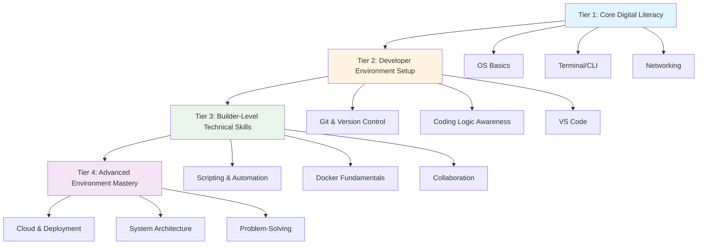

# Digital Foundation Skills for Modern Developers
### A Practical Framework for Technical Environment Mastery

> **Note:** These are *environment and tooling skills* — not programming or prompt engineering. Think of them as the "operating system" for becoming a functional developer.

---

## 🧱 Tier 1: Core Digital Literacy
*Start here if you're new to development environments*

### Understanding Your Operating System
- Know what an OS does (Windows, macOS, or Linux)
- Learn how files, folders, and permissions work
- Understand basic system tasks: installing apps, managing memory, using task manager

### Terminal & Command Line Basics
- Open and use a terminal or command prompt
- Navigate folders using `cd`, `ls`, `dir`
- Run simple commands, clear the screen, and understand what "commands" are

### Internet & Networking Basics
- Understand what a network, IP, and port are (in simple terms)
- Use the browser's developer tools and test connections using `ping` or `curl`
- Learn how websites communicate with servers (request → response)

---

## ⚙️ Tier 2: Developer Environment Setup
*Essential tools every developer needs to know*

### Git & Version Control
- Learn what version control is and why it matters
- Practice with `git clone`, `git add`, `git commit`, `git push`
- Understand GitHub as your online code storage and collaboration space

### Basic Coding Logic Awareness
- Understand what "code" really means — instructions for the computer
- Try simple logic examples in Python or JavaScript (print text, do math, loops)
- Learn about variables, data types, and conditions in simple, visual ways

### Using VS Code (or any modern editor)
- Install and use VS Code for editing files
- Learn how to open folders, run code, and use extensions
- Explore the built-in terminal and debugging features

---

## 💡 Tier 3: Builder-Level Technical Skills
*From using tools to creating with them*

### Scripting & Automation
- Write small Python or Bash scripts to automate tasks
- Understand how to read and write text files
- Schedule simple commands or scripts to run automatically

### Docker Fundamentals
- Learn what a "container" is and why it's used
- Try running an existing Docker image (e.g., `docker run hello-world`)
- Understand how containers help you share projects easily

### Collaboration & Team Practices
- Contribute to a small GitHub project
- Open pull requests and review others' code
- Communicate changes clearly through commit messages

---

## 🚀 Tier 4: Advanced Environment Mastery
*Optional growth skills for deployment and systems thinking*

### Cloud & Deployment Awareness
- Learn what "the cloud" means and why developers use it
- Try deploying a small app (e.g., with GitHub Pages or Render)
- Understand environment variables and secrets in deployment

### System Thinking & Architecture
- Learn how different parts of a system (frontend, backend, database) fit together
- Understand APIs and how apps talk to each other
- Explore diagrams that show how data flows in a web app

### Problem-Solving Mindset
- Learn how to debug when things go wrong (read error messages calmly)
- Practice searching smartly (Stack Overflow, docs, AI assistants)
- Build the habit of experimenting and documenting what you learn

---

## 📋 Learning Path Summary

---

## 🎯 Philosophy

This framework focuses on **environmental fluency** — the ability to navigate, configure, and troubleshoot the systems and tools that make modern development possible.

These skills answer questions like:
- *Where does my code actually run?*
- *How do I share my work with others?*
- *What happens when I press "deploy"?*
- *Why won't this tool install?*

Master these, and you'll have the foundation to learn any programming language or framework with confidence.
