# Mermaid in Modern Development: Visual Communication for the LLM Era

## Introduction

In today's development landscape, where Large Language Models (LLMs) can generate complex code and technical solutions instantly, we face a new challenge: **understanding and communicating the "why" behind the "what"**. 

Mermaid emerges as the perfect bridge between abstract technical concepts and human comprehension, transforming code and algorithms into visual stories that anyone can follow.

## What is Mermaid?

Mermaid is a JavaScript-based diagramming and charting tool that uses text-based syntax to create beautiful, dynamic diagrams. Think of it as "code for diagrams" - you write simple text descriptions, and Mermaid renders them as professional visualizations.


## The Core Problem Mermaid Solves

### The Translation Gap

When LLMs generate solutions, they often produce:
- ✅ Functionally correct code
- ✅ Optimized algorithms  
- ✅ Complete implementations
- ❌ **Visual context for human understanding**

### Traditional Documentation Challenges

- **Static text descriptions** fail to convey complex relationships
- **Hand-drawn diagrams** become outdated quickly
- **Complex UML tools** have steep learning curves
- **Separate documentation** gets disconnected from code

## Mermaid: The Universal Visual Language

### Why Mermaid Works in the LLM Era

1. **LLM-Friendly Syntax**: Simple text format that AI models understand naturally
2. **Universal Rendering**: Works across GitHub, VS Code, Notion, GitLab, and more
3. **Live Documentation**: Diagrams stay synchronized with your markdown
4. **No Special Tools**: Just text files that render everywhere

## Core Use Cases in Development

### 1. Visual Mind Mapping & Idea Exploration

Mermaid transforms abstract thinking into visual clarity, making it perfect for the early stages of any project - from product concepts to technical solutions.

#### Concept Brainstorming


#### Creative Problem Solving

```mermaid
graph TD
    Challenge[Design Challenge] --> Explore[Exploration Phase]
    Explore --> Option1[Traditional Approach]
    Explore --> Option2[Innovative Approach]
    Explore --> Option3[Hybrid Solution]
    
    Option1 --> Pros1[✅ Proven & Reliable]
    Option1 --> Cons1[❌ Limited Differentiation]
    
    Option2 --> Pros2[✅ Unique Value Prop]
    Option2 --> Cons2[❌ Higher Risk]
    
    Option3 --> Pros3[✅ Balanced Risk/Reward]
    Option3 --> Cons3[❌ Complexity Management]
    
    Pros1 --> Decision{Final Choice}
    Pros2 --> Decision
    Pros3 --> Decision
```


#### Idea Evolution Tracking


#### User Journey Ideation

**Simple Version**: Track user from problem to solution


**Why this works**: Each step is one simple action. Easy to understand where users might drop off.

### 2. Visual Debugging: Using Mermaid as a System Map

**Important**: Mermaid doesn't execute or test your code. It creates a **visual map** of how your system works. This map helps you and AI agents quickly understand where bugs might be when you get error messages.

**The Power**: Mermaid + Console Errors + AI = Faster Bug Detection

#### How It Works: The Complete Process

**Step 1**: Draw your system as a map
**Step 2**: Get error from console/logs  
**Step 3**: Match error to the map location
**Step 4**: Focus debugging on that specific part
**Step 5**: AI agents can also use this map to suggest solutions

#### Example: Login System Debug

**Your System Map** (Mermaid shows the flow, not execution):


**Step 2**: Console shows actual error:
```bash
Error: Connection timeout to database
at line 45 in userService.js
Status: 500 Internal Server Error
```

**Step 3**: Match error to map - it's Node D (Check database)

```mermaid
flowchart TD
    A[Frontend: Get input ✅] --> B[Frontend: Validate format ✅]
    B --> C[API: Receive request ✅]
    C --> D[API: Check database ❌ TIMEOUT ERROR]
    
    style D fill:#ffcdd2
```


**Step 4**: Now you know exactly where to look - database connection in userService.js, not login logic.

**Step 5**: AI agent can see the map + error and suggest: "Check database connection pool settings in Node D"

#### Real Example: E-commerce Bug Hunt

**System Map**:


**Console Error**:
```bash
Error: Cannot read property 'price' of undefined
at calculateTotal() line 123
ProductID: 456
```

**Map + Error = Quick Location**:

```mermaid
flowchart TD
    A[User clicks Buy ✅] --> B[Get product details ❌]
    B --> C[Check inventory]
    C --> D[Calculate price ❌ UNDEFINED ERROR]
    
    style B fill:#ffcdd2
    style D fill:#ffcdd2
```


**Analysis**: Error in Node D, but root cause is Node B (product details are undefined). Fix Node B.

**AI Agent Insight**: "Node B failed to get product 456 data, causing Node D to crash on undefined price. Check product API or database query for ID 456."

#### Advanced: Multiple Error Sources

**Complex System Map**:


**Multiple Console Errors**:
```bash
1. Auth Service: JWT token expired
2. Product Service: Database connection refused
3. Payment Service: Gateway timeout
```

**Map Shows the Problem Pattern**:


**System Analysis**: All services failing = network issue or infrastructure problem, not code bugs.

**AI Agent Analysis**: "Pattern shows infrastructure failure. All downstream services failing simultaneously. Check network connectivity, server resources, or deployment status."

#### How AI Agents Use Mermaid Maps

**Before Mermaid**: 
```
AI: "Check your login code for bugs"
You: *checks 200 lines of code*
```

**With Mermaid + Error Data**:
```
AI: "Error shows database timeout in Node D. Check connection pool settings in userService.js around line 45. Other nodes (A,B,C) are working fine."
You: *checks 5 lines of code*
```

#### Performance Debugging Example

**System Map with Timing**:


**Performance Console Data**:
```bash
Request took 5.2 seconds
- Parse Data: 10ms
- Validate Input: 15ms  
- Database Query: 4800ms ← PROBLEM
- Process Results: 200ms
- Format Response: 175ms
```

**Visual Analysis**:

```mermaid
flowchart TD
    A[API Request] --> B[Parse Data: 10ms ✅]
    B --> C[Validate Input: 15ms ✅]
    C --> D[Database Query: 4800ms ❌]
    D --> E[Process Results: 200ms ✅]
    E --> F[Format Response: 175ms ✅]
    
    style D fill:#ffcdd2
```


**AI Agent Suggestion**: "Node D takes 92% of total time. Check database indexes, query optimization, or connection issues. Nodes A,B,C,E,F are performing normally."

#### The Mermaid + Error Data Workflow

**Traditional Debugging**:
1. User reports bug
2. Look through entire codebase
3. Guess where problem might be
4. Test everything
5. Eventually find the issue

**Mermaid + Console + AI Workflow**:
1. User reports bug
2. Check console for actual error
3. Match error to Mermaid map location
4. Focus only on that node
5. AI agent suggests specific fixes for that node
6. Fix found in minutes, not hours

#### Benefits of This Approach

**For Developers**:
- 🎯 **Precise targeting** - know exactly where to look
- ⏱️ **Faster resolution** - debug 1 node instead of entire system
- 📊 **Pattern recognition** - see if multiple nodes failing (infrastructure issue)
- 🤖 **AI assistance** - agents understand your system structure

**For AI Agents**:
- 🗺️ **System context** - understand how components connect
- 🎯 **Focused suggestions** - give advice for specific failing node
- 📈 **Pattern analysis** - identify infrastructure vs code issues
- 🔄 **Iterative help** - track fixes across multiple nodes

**For Teams**:
- 📝 **Shared understanding** - everyone sees same system map
- 💬 **Clear communication** - "Node D is failing" vs "something is broken"
- 📚 **Documentation** - visual record of how system actually works
- 🔄 **Onboarding** - new team members understand system flow quickly

#### Key Principle

**Mermaid = The Map**  
**Console Errors = The GPS**  
**AI Agents = The Navigation Assistant**

Together, they help you reach the bug location faster than wandering through code without direction.

### 3. Algorithm Explanation

Instead of parsing complex nested logic:


### 2. System Architecture Visualization

Show how components interact:


### 3. Data Flow Documentation

Track information movement:


### 4. State Management

Visualize application states:


## Vibe Coding: Adapting to Creative & Technical Needs

### For Ideation & Creative Thinking
- **Mind maps** for exploring problem spaces and solution opportunities
- **Journey maps** for understanding user experiences and pain points
- **Concept trees** for breaking down complex ideas into manageable components
- **Decision trees** for evaluating options and trade-offs

### For Beginners: High-Level Concepts
- Simple flowcharts showing overall process
- Basic system overviews
- User journey maps

### For Intermediate Developers: Detailed Logic
- Sequence diagrams for API interactions
- Class relationship diagrams
- Database entity relationships

### For Expert Developers: Complex Architectures
- Detailed microservice topologies
- Advanced state machines
- Comprehensive system dependencies

## Creative Workflow Integration

### From Idea to Implementation

```mermaid
flowchart LR
    Brainstorm[💡 Brainstorm Ideas] --> Visualize[🎨 Create Mind Map]
    Visualize --> Research[🔍 User Research]
    Research --> Refine[✨ Refine Concept]
    Refine --> Design[📐 System Design]
    Design --> Prototype[🔨 Build Prototype]
    Prototype --> Test[🧪 User Testing]
    Test --> Iterate[🔄 Iterate]
    Iterate --> Launch[🚀 Launch]
```



### Collaborative Thinking Sessions

Using Mermaid in team brainstorming:
- **Real-time collaboration**: Multiple people can contribute to the same diagram structure
- **Structured creativity**: Framework guides productive exploration
- **Visual consensus**: Everyone sees the same mental model
- **Documented decisions**: Reasoning becomes part of the permanent record

## Practical Integration Strategies

### In Development Workflow

1. **Planning Phase**: Use Mermaid to sketch ideas before coding
2. **Implementation**: Generate diagrams to explain complex logic
3. **Code Review**: Include visual explanations for architectural decisions
4. **Documentation**: Embed diagrams directly in README files

### In Team Communication

- **PRDs (Product Requirements Documents)**: Visual user flows and system designs
- **Technical Specs**: Architecture diagrams and data flow charts
- **Onboarding**: System overviews for new team members
- **Incident Response**: System topology for faster debugging

## LLM Integration Examples

### Prompt Engineering for Mermaid

Instead of asking:
> "Explain how this authentication system works"

Try:
> "Create a Mermaid sequence diagram showing the OAuth flow in this authentication system"

Instead of:
> "Document this algorithm"

Try:
> "Generate a Mermaid flowchart explaining the decision logic in this sorting algorithm"

## Advanced Mermaid Patterns

### Creative Project Planning

#### Feature Prioritization Matrix


#### Product Roadmap Visualization


### Architectural Decision Records (ADRs)

```mermaid
graph TD
    Problem[Identify Problem] --> Options[Research Options]
    Options --> Decision{Make Decision}
    Decision --> Implement[Implement Solution]
    Implement --> Review[Review Outcome]
    Review --> Learn[Document Lessons]
```

### Feature Development Lifecycle

```mermaid
flowchart LR
    A[Initial] --> B[Feature Branch]
    B --> C[Design Phase]
    C --> D[Implementation]
    D --> E[Testing]
    E --> F{Quality Check}
    F -->|Pass| G[Merge to Main]
    F -->|Fail| D
    G --> H[Deploy]
    
    style A fill:#e3f2fd
    style G fill:#e8f5e8
    style H fill:#fff3e0
```

## Platform Support

### Native Rendering
- GitHub/GitLab markdown files
- VS Code with Mermaid extensions
- Notion pages
- Obsidian notes
- Many documentation platforms

### Programmatic Integration
- React components via `@mermaid-js/mermaid`
- Static site generators (Gatsby, Next.js, Hugo)
- Documentation tools (Docusaurus, GitBook)

## Benefits for Modern Development Teams

### Immediate Value
- **Faster Onboarding**: New team members understand systems visually
- **Better Code Reviews**: Visual context improves feedback quality
- **Clearer Communication**: Stakeholders grasp technical concepts easily
- **Living Documentation**: Diagrams stay current with code changes

### Long-term Impact
- **Knowledge Preservation**: Visual documentation survives team changes
- **Decision Tracking**: Architectural choices remain visible and understood
- **System Evolution**: Changes and their impacts become clearer
- **Technical Debt Management**: Complexity becomes visible and manageable

## Getting Started

### Basic Syntax Learning Path

1. **Flowcharts**: Start with simple decision trees
2. **Sequence Diagrams**: Move to interaction documentation
3. **System Diagrams**: Progress to architecture visualization  
4. **Advanced Types**: Explore state diagrams, user journeys, etc.

### Implementation Strategy

1. **Start Small**: Add one diagram to an existing README
2. **Pick Your Tool**: Choose your primary Mermaid-enabled platform
3. **Create Templates**: Build reusable diagram patterns for your team
4. **Integrate with Workflow**: Make diagram creation part of your development process

## Conclusion

Mermaid transforms technical communication from an afterthought into a first-class citizen of the development process. In an era where LLMs can generate complex solutions instantly, Mermaid provides the visual context that helps humans understand, validate, and improve those solutions.

The future of development documentation isn't just about what the code does—it's about making the "why" and "how" as clear as the "what". Mermaid makes that future accessible to every developer, regardless of their design skills or tool preferences.

**Start today**: Add one Mermaid diagram to your next pull request. Watch how it transforms the conversation around your code.

---

*Ready to visualize your next idea? Remember: every complex system started as a simple diagram.*
