# Vibe Coding Process Summary

This Mermaid diagram summarizes the complete Vibe Coding Development Lifecycle (VCDL) from the handbook:

```mermaid
flowchart TD
    %% Start
    A[Start: New Feature Request]:::start --> GIT1[Create feature branch<br/>git checkout -b feature/name]:::process

    %% Feature Assessment
    GIT1 --> B{Feature Analysis}:::decision

    subgraph one["1️⃣ Feature Assessment"]
        style one fill:#E8F4FC,stroke:#2196F3,stroke-width:2px,rx:10
        B --> C{Can be subdivided?}:::decision
        C -->|Yes| D[Break into sub-features]:::process
        C -->|No| E[Single feature identified]:::process
        D --> F[Process each sub-feature]:::process
        F --> E
    end

    %% Risk Evaluation
    subgraph two["2️⃣ Risk Evaluation"]
        style two fill:#FFF3E0,stroke:#FF9800,stroke-width:2px,rx:10
        E --> G[Assess feature criticality<br/>Score: Impact × Reversibility]:::process
        G --> H{Risk Score?}:::decision
        H -->|High Risk<br/>15-20| I[Human-led approach<br/>AI for reference only]:::critical
        H -->|Medium Risk<br/>11-14| J[AI assists<br/>Human leads implementation]:::medium
        H -->|Low Risk<br/>4-10| K[AI generates<br/>Human reviews thoroughly]:::low
    end

    %% Planning
    subgraph three["3️⃣ Planning"]
        style three fill:#E0F7FA,stroke:#00BCD4,stroke-width:2px,rx:10
        I --> L[Create detailed plan<br/>with security focus]:::process
        J --> L
        K --> L
        L --> M[Save to /plans/active/<br/>feature-name.md]:::process
        M --> N{Plan approved<br/>by stakeholders?}:::decision
        N -->|No| L
        N -->|Yes| O[Plan finalized &<br/>ready for implementation]:::process
    end

    %% Context Setup
    subgraph four["4️⃣ Context Setup"]
        style four fill:#FFF9C4,stroke:#FFC107,stroke-width:2px,rx:10
        O --> P[Prepare .ai/context/ files<br/>project.md, architecture.md]:::process
        P --> Q[Start fresh AI session<br/>Reset context window]:::process
        Q --> WARM{Select warm-up type}:::decision
        WARM -->|New Feature| R1[Feature development prompt]:::process
        WARM -->|Debug| R2[Debugging prompt]:::process
        WARM -->|Review| R3[Code review prompt]:::process
        R1 --> S[Load project context +<br/>feature plan]:::process
        R2 --> S
        R3 --> S
    end

    %% Model Selection
    subgraph model["🤖 Model Selection"]
        style model fill:#F3E5F5,stroke:#9C27B0,stroke-width:2px,rx:10
        S --> MODEL{Task complexity?}:::decision
        MODEL -->|Simple| M1[Economy: GPT-4 mini]:::process
        MODEL -->|Medium| M2[Balanced: GPT-5/Sonnet]:::process
        MODEL -->|Complex| M3[Flagship: Opus]:::process
        M1 --> T
        M2 --> T
        M3 --> T
    end

    %% Development Loop
    subgraph five["5️⃣ Development Loop"]
        style five fill:#E8F5E8,stroke:#4CAF50,stroke-width:2px,rx:10
        T[AI generates code<br/>following plan steps]:::process
        T --> U[Human review &<br/>security validation]:::process
        U --> V[Write comprehensive tests<br/>Unit + Integration + E2E]:::process
        V --> W[Run test suite<br/>Check 80% coverage target]:::process
        W --> X{All tests<br/>pass?}:::decision
        X -->|No| Y[Debug with AI<br/>Fix failing tests]:::process
        Y --> T
        X -->|Yes| Z[Git commit with<br/>descriptive message]:::process
        Z --> REF{Feature count<br/>check}:::decision
        REF -->|3+ features| REF1[Quick cleanup]:::process
        REF -->|5+ features| REF2[Structural review]:::process
        REF -->|10+ features| REF3[Major refactoring]:::process
        REF -->|Less than 3| AA
        REF1 --> AA
        REF2 --> AA
        REF3 --> AA
        AA{Feature<br/>complete?}:::decision
        AA -->|No| BB{Context window<br/>getting full?}:::decision
        BB -->|Yes| CC[Reset AI session<br/>Reload context & plan]:::process
        CC --> T
        BB -->|No| T
        AA -->|Yes| DOC[Generate documentation<br/>Update README & API docs]:::process
    end

    %% Git finalization
    DOC --> GIT2[Push to remote<br/>Create pull request]:::process
    GIT2 --> DD[Feature ready<br/>for deployment]:::success
    DD --> EE[Feature delivered<br/>& documented]:::endNode

    %% Node styles
    classDef start fill:#E1BEE7,stroke:#9C27B0,stroke-width:3px,color:#000
    classDef process fill:#BBDEFB,stroke:#2196F3,stroke-width:2px,color:#000
    classDef decision fill:#FFCDD2,stroke:#F44336,stroke-width:2px,color:#000
    classDef critical fill:#FFEBEE,stroke:#D32F2F,stroke-width:3px,color:#000
    classDef medium fill:#FFF8E1,stroke:#F57C00,stroke-width:2px,color:#000
    classDef low fill:#F1F8E9,stroke:#689F38,stroke-width:2px,color:#000
    classDef success fill:#C8E6C9,stroke:#4CAF50,stroke-width:3px,color:#000
    classDef endNode fill:#D1C4E9,stroke:#7B1FA2,stroke-width:3px,color:#000
```

## Process Overview

This diagram shows the complete workflow for AI-assisted development:

1. **Feature Assessment** - Break down and analyze requirements
2. **Risk Evaluation** - Determine AI vs human roles based on criticality
3. **Planning** - Create detailed implementation plans
4. **Context Setup** - Prepare AI context and warm-up sessions
5. **Development Loop** - Iterative coding with testing and refactoring

The process emphasizes risk-based development, proper context management, and iterative improvement cycles.
